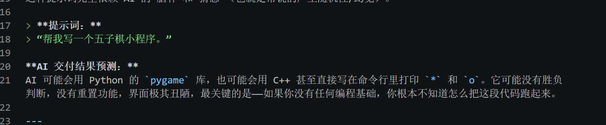

## 流程交互

- 对于出现提示词的部分，可以一键点击“复制”/“添加到AI助手”/按钮

- （是否需要）对于实战案例，可在案例的题目描述附近添加“添加到DL4ALL在线编辑器”的按钮，在DL4ALL在线编辑器的模块中，左侧可伸缩栏中出现题目描述

## 书籍亮点

- 能否在AI助手处，新增一个完整版，点击可以新开一个界面。界面左侧是AI助手，最好可以选择AI问答模型（这里可以衔接上用户充值TOKEN的功能），左侧主要功能是和AI交互获得更好的prompt；右侧是点击运行后可以预览当前prompt运行的成果，以快速检验项目质量。

## 案例设计

### 实战一：效率工具与自动化脚本

项目要求：

* 本地文件系统管理（PowerShell/Python）
* API 调用与文件读写权限处理

* **目标：** 让 AI 写一小段代码，自动帮你把桌面上乱七八糟的文件按类型（图片、文档、视频）分门别类丢进不同的文件夹。
* **学习点：** 体验 AI 如何操控本地文件，安全且实用。

提示词模版：

> **角色设定**
> 你是一位资深的系统自动化开发工程师，精通 Python 和 PowerShell，编写的代码以“安全、健壮、易读”著称。
> **核心任务**
> 请帮我编写一个【桌面文件自动整理】脚本。该脚本需要扫描我的电脑桌面，将零散的文件按类型（图片、文档、视频、其他）自动移动到对应的归档文件夹中。
> **功能与分类要求**
> 1. **分类规则**（请在代码中使用字典配置，方便我后续扩展）：
> * 🖼️ **图片 (Images):** `.jpg`, `.jpeg`, `.png`, `.gif`, `.bmp`, `.webp`
> * 📄 **文档 (Documents):** `.pdf`, `.docx`, `.doc`, `.xlsx`, `.csv`, `.pptx`, `.txt`, `.md`
> * 🎬 **视频 (Videos):** `.mp4`, `.mov`, `.avi`, `.mkv`
> * 📦 **其他 (Others):** 不属于上述类型的文件
> 
> 
> 2. **目标目录：** 在桌面上自动创建一个名为 `[桌面归档_日期]` 的主文件夹，并在其中生成上述四个子文件夹。
> 
> 
> **安全与健壮性要求（非常重要）**
> 1. **排除项：** 严格排除所有快捷方式（`.lnk`，如果是 Mac 则是 `.alias`）、隐藏文件（如 `.DS_Store`、`desktop.ini`）、正在运行的脚本本身以及系统文件夹，**只处理普通文件**。
> 2. **冲突处理：** 如果目标文件夹中已存在同名文件，**严禁覆盖**。请在文件名后自动追加数字序号（例如 `report(1).pdf`）。
> 3. **权限与异常捕获：** 必须使用 Try-Except (或 Try-Catch) 块捕获文件被占用、权限不足等错误。发生错误时跳过该文件，并在控制台输出警告信息，保证程序不会直接崩溃。
> 4. **演练模式 (Dry-run)：** 代码中需包含一个 `DRY_RUN = True` 的开关参数。当开启时，只在控制台打印“准备将 [文件A] 移动到 [文件夹B]”，不执行实际移动。方便我测试运行。
> 
> 
> **输出要求**
> * 请优先提供 **Python** 版本的实现代码（需使用标准库如 `os`, `shutil`, `pathlib`，无需额外 pip 安装）。
> * 代码必须包含详细的中文注释。
> * 在代码末尾，请简短说明如何运行此脚本，以及如何切换 `DRY_RUN` 模式。

### 实战二：网页版倒计时

项目要求：

* 全流程闭环：需求构思 -> 架构 Prompt -> 代码生成 -> 终端调试 -> 成果验证与 Git 提交
* 人机协作价值复盘

* **全流程体验：**
1. 你用文字提需求：“我要个网页版倒计时”。
2. AI 生成网页画面和按钮。
3. AI 补齐倒计时的时间逻辑。
4. 点击运行，发现倒计时停不下来（模拟 Bug）。
5. 把问题喂给 AI，让它帮你修好。

提示词模板：

> **[角色设定]**
> 你是一位资深的前端开发工程师，擅长编写结构清晰、UI 极简且现代的 Web 应用，并且严格遵循我的指令。
> **[背景说明]**
> 我正在进行一个本地前端项目的开发实战，需要快速构建一个工具类的网页原型，用于后续的 Git 工作流测试。
> **[任务指令]**
> 请帮我编写一个“网页版倒计时工具”的核心代码。具体需求如下：
> 1. **界面布局：** 采用深色模式（Dark Mode）。屏幕正中央使用特大号、等宽字体显示初始时间 `00:10`（10秒）。
> 2. **交互设计：** 时间正下方有一个醒目的“开始”按钮。按钮需要有基础的悬停（Hover）动效。
> 3. **核心逻辑：** 点击“开始”按钮后，使用 JavaScript 的 `setInterval` 函数，让显示的时间每秒递减 1 秒，并实时更新到页面上。
> 
> 
> **[约束条件]**
> * **极简架构：** 必须将 HTML、CSS（可内联或写在 `<style>` 中）和 JavaScript 全部写在同一个 `index.html` 文件内，**绝对不要**引入任何外部框架或库（如 Vue/React/Tailwind）。
> * **可读性：** JS 逻辑部分必须包含详细的中文注释，特别是 DOM 元素的获取和定时器的触发逻辑。
> 
> 
> **[输出格式]**
> 1. 请直接输出可以直接复制运行的完整 `index.html` 代码块。
> 2. 代码输出完毕后，请附带提供一条符合 Angular 规范的 Git Commit Message，用于我稍后的代码提交（例如 `feat: ...`）。
> 

