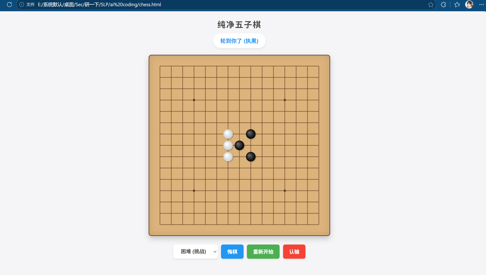

# 《AI 辅助编程实战》大纲

## 第零部分：新书导入

（见“新书导入.md”）

---

# 上篇：打通AI CODING全流程

**主线贯穿：从零开发“网页版五子棋”小程序**

*通过一个可视化的网页小游戏，带读者跑通无需配置本地环境的 AI Coding 基础闭环。让读者快速上手，无忧环境配置。*

基本流程：用户跟着教程生成五子棋网页文件（chess.html），下载到本地，用浏览器运行即可。

基本功能：（见“五子棋.md”）

网页版五子棋的效果：（运行"chess.html"）

进阶工具（部署到公网）：静态网站托管服务：https://www.900.cool/

## 第一部分：基础设施与意图转译

### 第1章 重新定义编程与 AI 边界

* 范式转换：从代码编写者到架构审查员
* AI 的优势领域（重构/正则/算法）
* AI 的局限盲区（复杂架构/核心机密/幻觉）

* AI优劣可结合五子棋：AI 擅长写棋盘 UI 与胜负判断，但不擅长处理极度复杂的对战策略

### 第2章 AI 工具解析

* （重点）对话式模型（ChatGPT / DeepSeek / Claude）
* 深度集成 IDE（Cursor / Trae）
* 终端与辅助工具（GitHub Copilot / CLI）

* 结合五子棋：对于网页端开发需求，我们如何选择合适的轻量级的AI工具？如何在网页端向大模型下达初始开发指令

### 第3章 需求拆解法 (Plan Phase)

* 伪代码驱动业务逻辑
* 任务切片与模块化拆解

* 任务切片：将五子棋拆解为“绘制棋盘”、“落子交互”、“胜负判定”三大模块

### 第4章 AI Coding Prompt 框架

* CRISPE 框架应用（角色/任务/约束/格式）
* Few-Shot 示例投喂：让 AI 模仿特定的棋盘 CSS 风格与视觉反馈

* prompt训练：对比随意的/有框架的prompt，做几个关于五子棋网页的小练习题，【前后端】在水杉智能学习平台查看代码，在AI助手实时查看效果

### 第5章 上下文管理

* 长对话防截断策略：为五子棋增加“悔棋”功能时，如何高效传递历史代码
- LLM沟通每次都全部保存对话并发送，利用这个特性发现一些沟通技巧
* 沟通技巧：全量代码保存与局部更新的取舍

### 第6章 人机协作

* 核心原则：人类定需求与验收，AI 跑通中间逻辑

* 结合五子棋：人类负责测试游戏体验与寻找 Bug，AI 负责修复 html/csss/JS 逻辑缺陷

### 第7章 封闭式自动化检验实战

*预设标准答案，通过 Test Case（测试用例）严格检验 AI 生成代码的逻辑严密性。*

* **实战一：组合数学与模运算求解器**
* **场景：** 给定复杂的排列组合与整数划分条件，要求 AI 编写结合模运算的高效求解算法。
* **检验：** 输入包含超大整数边界值的测试脚本，严格比对输出结果的正确性与时间复杂度。

* **实战二：经典动态规划（DP）的现实应用**
* **场景：** 外卖满减最优凑单策略（背包问题变体）。
* **检验：** 随机生成含有百种菜品与价格的数组，通过断言（Assert）验证模型输出的最高性价比方案。

---

# 下篇：本地端 AI Coding 与工程实践

**主线贯穿：开发本地文件自动化整理工具——“文件小助手”**

*脱离网页，深入本地 IDE 与终端，安全且高效地让 AI 操控你的系统环境。*

## 第二部分：环境、调试与质量控制

### 第8章 核心环境与模型配置

* 本地 IDE（Cursor / Trae）与 CLI 工具入门

主要教用户如何在本地使用ai coding，环境配置，使用技巧，介绍如codex,trae等使用，模型的选取，模型的配置

* 结合文件管家：新建本地工作区、配置 Python/脚本环境与模型参数选择

### 第9章 本地上下文与多文件穿透

* 目录结构 (Tree) 与依赖关系传递
* 结合文件管家：如何让 AI 准确理解你的桌面文件夹树状结构与分类规则
* 外部文档引入与全局文件提醒技巧

### 第10章 报错排查与终端调试 (Debugging)

* 终端 Error Log 与堆栈提取
* 结合文件管家：解决 AI 批量移动文件时产生的“路径找不到”或“权限拒绝 (Permission Denied)”等系统级报错
* 逐行解析与依赖冲突排查

### 第11章 代码审查与结果验证

* 核心逻辑与边界条件人工校验
* 结合文件管家：执行文件级操作前的“Dry Run（试运行）”设计与安全审计
* 安全审计与性能复杂度优化
* 自动化单元测试生成与代码简洁度优化

### 第12章 Harness Engineering (测试台工程)

* 什么是 Harness Engineering
* 为什么需要 Harness Engineering
* Harness Engineering 的四大支柱
* 先进团队的实战经验分享

### 第13章 开放式综合实战一：效率工具与自动化脚本

* 本地文件系统管理（PowerShell/Python）
* API 调用与文件读写权限处理
* 平台提供测试文件

* **目标：** 让 AI 写一小段代码，自动帮你把桌面上乱七八糟的文件按类型（图片、文档、视频）分门别类丢进不同的文件夹。
* **学习点：** 体验 AI 如何操控本地文件，安全且实用。

### 第14章 开放式综合实战二：

泰坦尼克生存预测（分类入门）

数据集：12列特征（含年龄/舱位等级等）

技能重点：缺失值填充策略（众数/中位数）、类别特征编码（One-Hot vs Target Encoding）、模型可解释性分析（SHAP值）

挑战目标：在Kaggle Leaderboard冲进前10%（Accuracy>0.81）

项目数据链接：
https://www.kaggle.com/code/alexisbcook/titanic-tutorial

### 第15章 开放式综合实战三：

MNIST手写数字识别（CV基础）

技能重点：CNN架构设计（LeNet→ResNet）、数据增强（旋转/平移）、模型轻量化（知识蒸馏）

高阶玩法：在Kannada MNIST数据集实现迁移学习

项目数据链接：

https://www.kaggle.com/datasets/martininf1n1ty/mnist100?resource=download