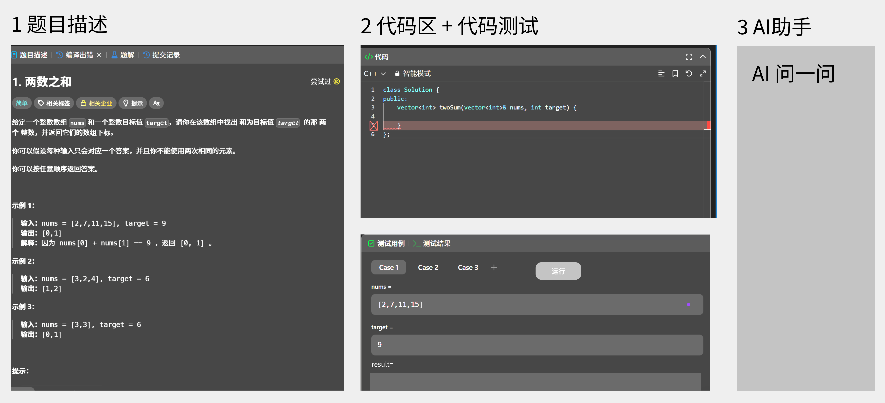
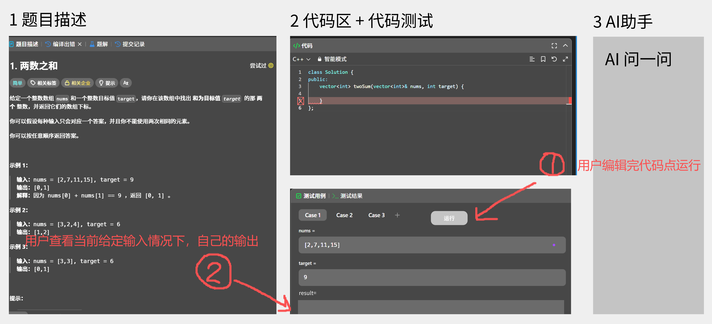
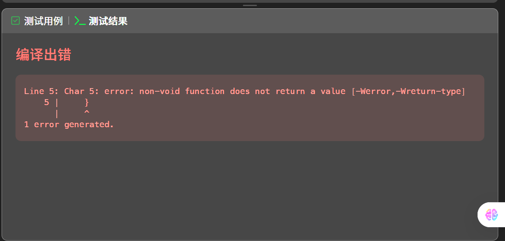

# 平台能力支持

上篇：

AI 助手区域：
- 支持更改html文件
- 同时实时显示html文件渲染结果
- 【可选】：支持html文件的下载

### 习题部分：

习题部分想要有一个测试题目的环节

就是中间代码这里，下面允许切换测试习题，测试分为两种，一种是要通过三个给定的测试用例，一种是预设测试脚本跑用户代码判断正误

点击测试用例，默认case1，点击case2/3可切换，再点击运行可查看当前点情况下，运行的结果如何

若点击测试结果，则后台运行测试代码,并显示测试结果

