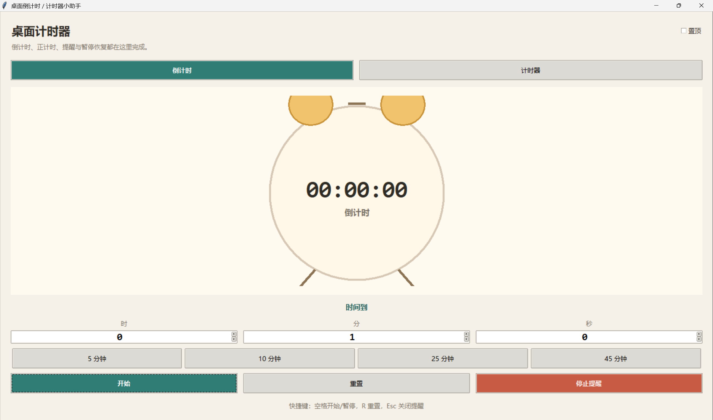

项目名：本地桌面倒计时/计时器小助手

特点：开放式、git使用、难度适中

* 全流程闭环：需求构思 -> 架构 Prompt -> 代码生成 -> 终端调试 -> 成果验证与 Git 提交
* 人机协作价值复盘

* **全流程体验：**
1. 你用文字提需求：“我要个倒计时/计时器”。
2. AI 生成桌面应用，需要画面和按钮。
3. AI 补齐倒计时/计时器的时间逻辑。
4. （可能遇到）点击运行，发现倒计时停不下来（模拟 Bug）。
5. 把问题喂给 AI，让它帮你修好。
6.（可选）让AI帮你拓展计时器/倒计时的功能需求
7.（可选）让AI帮你美化计时器的UI，设计成一个类似闹钟的外观

## 运行方式

本目录已生成一个本地桌面版倒计时/计时器应用：

- Windows 下双击 `run_timer.bat`
- 或在终端进入 `timer` 目录后运行：`python timer_app.py`

主要功能：

- 倒计时：支持时/分/秒输入、5/10/25/45 分钟预设、开始、暂停、继续、重置、到点提醒。
- 计时器：支持开始、暂停、继续、重置、计次记录。
- 桌面体验：支持窗口置顶、空格开始/暂停、R 重置、Esc 关闭提醒。

### 目前界面

